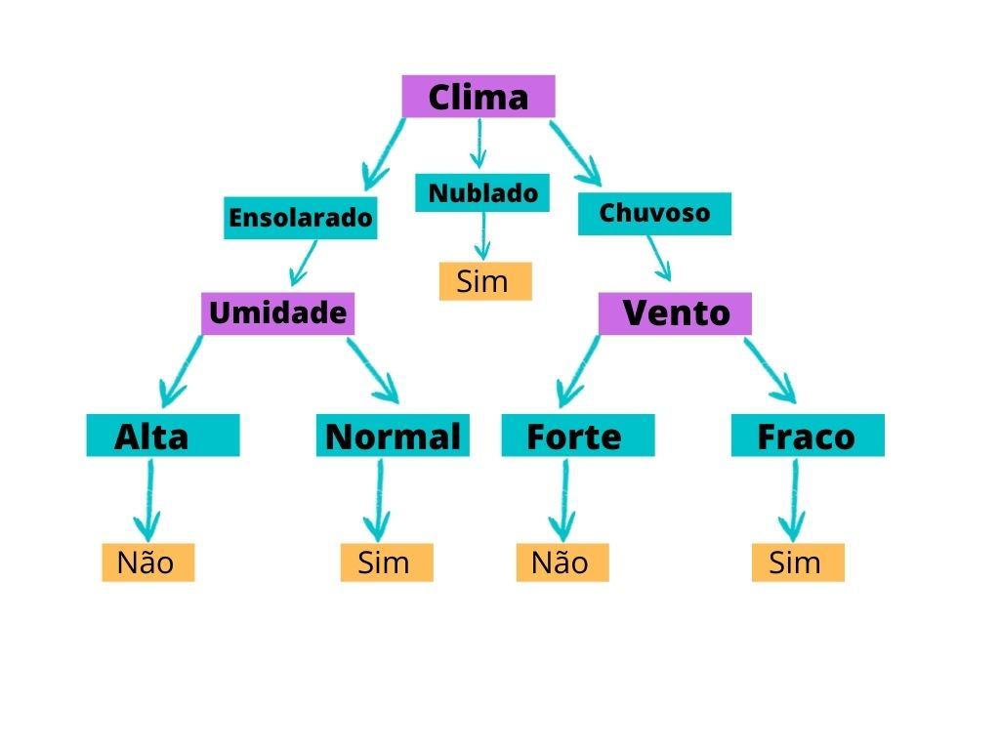
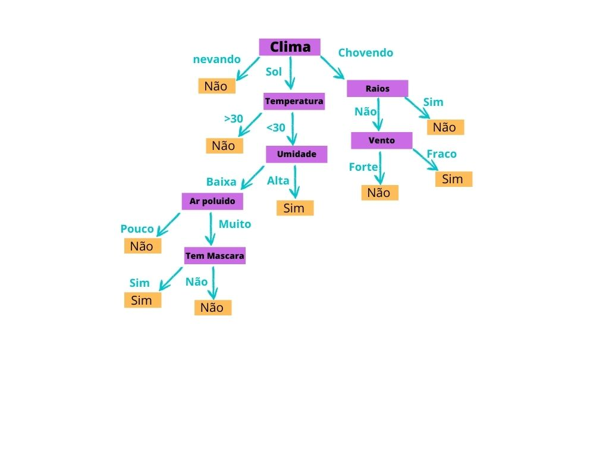

```{r setup, include=FALSE}
knitr::opts_chunk$set(echo = TRUE)
```


<center>

</center>


Floresta aleatória é um método de aprendizado de máquina pertencente a classe de métodos de aprendizado conjunto (ensemble learning methods) pois não é um modelo unitário, mas uma combinação de outros modelos. 

Mas, antes de falarmos de florestas aleatórias em si ...

<center>

</center>


Vamos falar brevemente do modelo que dá origem a uma floresta aleatória...as arvores de decisão (ou decision trees).

#### __Árvores de Decisão__

Vamos imaginar um exemplo, uma pessoa que gosta de jogar futebol ao ar livre e, ao longo do tempo foi observado que o comparecimento dessa pessoa no jogo depende de uma série de fatores associados ao clima, como temperatura, umidade, chuva, vento, etc. Podemos representar isso com a seguinte estrutura: 

<center>

</center>


Esse e um exemplo relativamente rudimentar, mas que exemplifica muito bem arvores de decisão, mas só para colocar um pouco de formalidade nos termos 😊: Os pontos em que é tomada uma decisão entre qual caminho seguir são os nós (nas caixas violeta), a conexão entre esses nos são os ramos (nas setas azul marinho, com o titulo do ramo nas caixas da mesma cor), o nó inicial que inicia o processo de divisão é a raiz (Clima), os últimos nos em ramos são as folhas (nas caixas em laranja) e por fim a distância entre as folhas e a raiz é a altura da arvore (legal né?).  

Observemos que intuitivamente já vemos o funcionamento básico de uma arvore, a partir de um conjunto de informações, vamos tomando decisões a partir de parâmetros que descrevem esse conjunto e por fim chegamos em uma resposta (ou classificação) do que queremos responder. 

Mas vamos incrementar um pouco as coisas e imaginar que não queremos responder se apenas uma pessoa especifica vai ao jogo, mas sim queremos um modelo que responda isso para diversas pessoas que estão em condições climáticas diferentes, e, que o nosso modelo de arvore agora é um pouco mais elaborado, como: 

<center>
<figure>

    <figcaption></figcaption>
</figure>
</center>


Sim, um pouco exagerado, mas, agora que os nós em que decidimos qual ramo seguir ficam tão específicos, conforme a altura da arvore aumentou, que acabamos ajustando nosso modelo para uma situação par locais muito específicos, e com isso acabamos falhando no objetivo que era um modelo genérico 😕. 

Então, como corrigir isso? 

Bom existem diversas maneiras, mas vamos seguir por uma delas, e, imaginar um modelo que não se baseasse em uma única arvore, mas várias, em que cada uma vai ser parametrizada com dados (nós) aleatórios que dividem bem nosso conjunto de dados, ou seja, não vamos ter a classificação baseada em uma única arvores, mas um conjunto delas, ou ... uma floresta 😀. 

<center>

</center>


#### __Florestas Aleatórias__

Finalmente chegamos então ao modelo de florestas aleatórias, que assim como arvores de decisão pode ser usado para classificação ou regressão, e, para criarmos um modelo assim, uma das maneiras é quebrar nosso conjunto de dados em vários conjuntos menores, e, a partir deles criar uma série de arvores de decisão distintas, e a resposta desse modelo é geralmente a média das respostas das arvores que o compõe.  

E para reduzirmos o ajuste excessivo dos dados a uma única situação, na criação das arvores de decisão usamos um método estocástico (uma palavra bonita pra aleatório 😊) na escolha dos parâmetros que formam os nós, ou seja, escolhemos aleatoriamente, mas de maneira que os dados ficam bem divididos (para isso tem algumas funções matemáticas que conduzem esse processo), os pontos em que tomamos a decisão de qual ramo seguir. 

# Referências:
- Artigos Web:
    * [Turing Talks - Modelos de Predição: Random Forest](https://medium.com/turing-talks/turing-talks-18-modelos-de-predi%C3%A7%C3%A3o-random-forest-cfc91cd8e524)
    * [Turing Talks - Modelos de Predição: Introdução à Predição](https://medium.com/turing-talks/turing-talks-10-introdu%C3%A7%C3%A3o-%C3%A0-predi%C3%A7%C3%A3o-a75cd61c268d)
    * [Turing Talks - Modelos de Predição: Decision Tree](https://medium.com/turing-talks/turing-talks-17-modelos-de-predi%C3%A7%C3%A3o-decision-tree-610aa484cb05)
    
    
- Livro: 
    * James, G., Witten, D., Hastie, T., & Tibshirani, R. (2013). An introduction to statistical learning (1st ed.) [PDF]. Springer. Cap. 8 (Tree-Based Methods)
 
 
- Fonte das imagens:
    * [Figura 1](https://unsplash.com/s/photos/tree)
    * [Figura 2](https://dontcallmejeh.tumblr.com/)
    * Figuras 3 e 4 eu criei no canvas baseado no modelo do livro citado acima
    * [Figura 5](https://aminoapps.com/c/armyaminobr/page/blog/tcharam/lla3_BkSQugnbL2ZldBmQXD21gvLLG1m0K)
