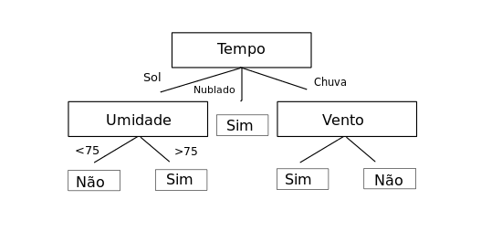

# Random Forests (Florestas Aleatórias)

## Árvores de Decisão

## Florestas Aleatórias

# Referências:
- Artigos Web:
    * [Turing Talks - Modelos de Predição: Random Forest](https://medium.com/turing-talks/turing-talks-18-modelos-de-predi%C3%A7%C3%A3o-random-forest-cfc91cd8e524)
    * [Turing Talks - Modelos de Predição: Introdução à Predição](https://medium.com/turing-talks/turing-talks-10-introdu%C3%A7%C3%A3o-%C3%A0-predi%C3%A7%C3%A3o-a75cd61c268d)
- Livros: 
    * James, G., Witten, D., Hastie, T., & Tibshirani, R. (2013). An introduction to statistical learning (1st ed.) [PDF]. Springer. Cap. 8 (Tree-Based Methods)